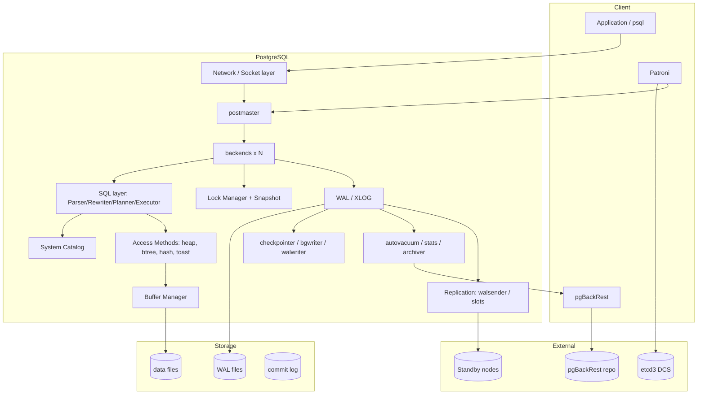
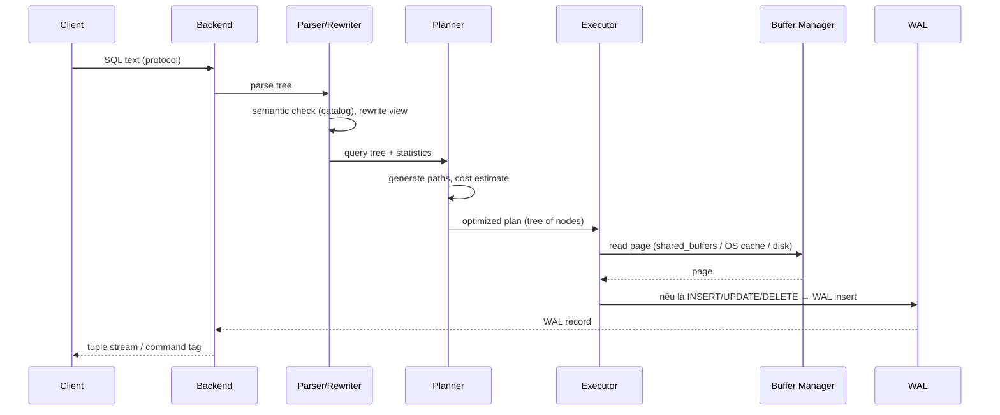

# Phân tích Thiết kế PostgreSQL

## 1. Mục tiêu tài liệu

Phân tích **thiết kế kiến trúc** (architectural design) của PostgreSQL:

- Các quyết định thiết kế lớn và lý do.
- Sơ đồ thành phần, phân lớp, luồng thực thi.
- Đánh giá điểm mạnh / điểm yếu / đánh đổi (trade-off).
- Liên hệ với cluster `cluster_1` đang vận hành.

Đối tượng: DevOps/DBA, kỹ sư cần tài liệu phân tích hệ thống (đào tạo, báo cáo, đánh giá kiến trúc).

Tiền đề kiến thức: [postgres_fundamentals.md](postgres_fundamentals.md).

---

## 2. Mục tiêu thiết kế (Design Goals)

PostgreSQL được thiết kế xoay quanh 4 mục tiêu:

```text
1. Extensibility   — mở rộng mà không cần sửa lõi engine
2. Standards       — tuân thủ SQL standards, hành vi có thể dự đoán
3. Reliability     — không mất dữ liệu: WAL, crash recovery, ACID
4. Correctness     — ưu tiên đúng đắn hơn nhanh trong edge case
```

Hệ quả trực tiếp của các mục tiêu này:

```text
Extensibility -> system catalog là data, mọi thứ là object (type, operator, index)
Standards     -> parser/semantics phức tạp, nhiều tính năng SQL chuẩn
Reliability   -> WAL write-ahead, fsync bắt buộc (synchronous_commit=on)
Correctness   -> lock manager chặt, MVCC snapshot nhất quán, chi phí tối thiểu
```

---

## 3. Sơ đồ Phân lớp (Layered Architecture)

```text
┌──────────────────────────────────────────────────────────────┐
│ L5  Client / Application                                      │
│     psql, JDBC, ORM, pgBackRest, Patroni, pg_dump             │
├──────────────────────────────────────────────────────────────┤
│ L4  Client Protocol (Frontend/Backend protocol)               │
│     libpq — auth (scram-sha-256), type system, COPY, escape   │
├──────────────────────────────────────────────────────────────┤
│ L3  Query Layer                                               │
│     Parser → Analyzer/Rewriter → Planner (cost-based)         │
│     → Executor (iterator)                                     │
├──────────────────────────────────────────────────────────────┤
│ L2  Language & Extension Layer                                │
│     PL/pgSQL, PL/Python, extension, custom type/operator,     │
│     index access method, FDW                                  │
├──────────────────────────────────────────────────────────────┤
│ L1  Storage Engine                                            │
│     Heap (MVCC tuples) · TOAST · B-tree/hash index            │
│     Buffer Manager · Free Space Map · FSM/VM                  │
├──────────────────────────────────────────────────────────────┤
│ L0  Durability & Concurrency Layer                            │
│     WAL (XLOG) · Checkpoint · Commit Log (clog/xact)          │
│     Lock Manager · Snapshot/MVCC · Replication (walsender)    │
├──────────────────────────────────────────────────────────────┤
│ L-1 OS / Hardware                                             │
│     Filesystem (ext4/xfs), page cache, block device, fsync    │
└──────────────────────────────────────────────────────────────┘
```

Đọc từ dưới lên: mọi guarantee (ACID, replication) đều bắt nguồn từ **L0**.

---

## 4. Sơ đồ Thành phần (Component Diagram)



### 4.1 Vai trò từng thành phần

| Thành phần | Trách nhiệm | Điểm thiết kế liên quan |
|---|---|---|
| postmaster | listener, fork backend, quản lý lifecycle | process model, restart an toàn |
| backends | parse/execute/lock/WAL cho 1 kết nối | isolation giữa các client |
| System Catalog | metadata lưu dưới dạng bảng | "everything is a table" -> extensible |
| Access Methods | giao diện đọc/ghi dữ liệu (heap, btree...) | pluggable AM (đã có table AM từ PG12) |
| Buffer Manager | cache page, smgr I/O | tách logical page từ physical I/O |
| Lock Manager | deadlock detect, table/row lock | đúng đắn trước tốc độ |
| WAL | durability + replication + recovery | write-ahead, single source of truth |
| autovacuum | thu hồi tuple chết, freeze xid | hậu quả tất yếu của MVCC |

---

## 5. Luồng thực thi một câu Query



Điểm thiết kế quan trọng:

```text
1. Planner "cost-based": không phụ thuộc rule-based heuristic
   -> cần statistics đúng (ANALYZE / autovacuum analyze)

2. Executor là iterator (Volcano model): mỗi node trả 1 tuple/lần next()
   -> dễ thêm node mới (partition append, gather parallel...)

3. Mọi thay đổi đều đi qua WAL TRƯỚC khi trả kết quả
   -> durability được đảm bảo trước khi client nhận "COMMIT"
```

---

## 6. Process Model — Phân tích thiết kế

### 6.1 Quyết định: process-per-connection

```text
PostgreSQL : 1 connection = 1 OS process (address space riêng)
MySQL/InnoDB: 1 connection = 1 thread (shared address space)
```

### 6.2 Lý do thiết kế

```text
Ưu điểm:
  + Cách ly bộ nhớ: crash của 1 query không làm hỏng process khác
  + Đơn giản hóa concurrency (không cần shared-state discipline phức tạp)
  + Dễ dùng OS-level isolation (cgroup, seccomp, kill từng query)
  + PG có thể dùng multiple query executor như parallel workers

Nhược điểm:
  - Tốn RAM/ process (mỗi backend ~ vài MB trở lên)
  - Không scale ngàn connections trực tiếp -> cần connection pooler (pgbouncer)
  - Context switch nhiều hơn thread khi connection rất đông
```

### 6.3 Hệ quả thiết kế trong cluster này

```ini
max_connections: 50
```

```text
50 connections với process model là hợp lý cho node nhỏ.
Nếu cần scale connections -> đặt pgbouncer phía trước, KHÔNG tăng max_connections tùy tiện.
```

### 6.4 Shared memory là điểm "bắt buộc dùng chung"

```text
Dù process riêng, backend phải dùng chung:
  - shared_buffers   : cache page
  - WAL buffers
  - lock table
  - proc array       : danh sách transaction đang chạy (cho snapshot)
  - stats shared memory
=> Đây là lý do postmaster fork SAU khi khởi tạo shared memory.
```

---

## 7. System Catalog — "Database như Data"

### 7.1 Thiết kế

Mọi object metadata đều là hàng trong bảng hệ thống:

```text
pg_class      : relation (table, index, sequence)
pg_attribute  : column
pg_index      : index definition
pg_type       : data type
pg_proc       : function
pg_am         : access method
pg_authid     : role
```

```sql
-- Ví dụ: bảng của user thực chất cũng là catalog entry
SELECT relname, relfilenode, relpages FROM pg_class WHERE relname = 'mytable';
```

### 7.2 Hệ quả

```text
Ưu điểm:
  + INFORMATION_SCHEMA / pg_catalog thống nhất
  + Extension có thể thêm object kiểu như object built-in
  + UPDATE/SELECT catalog được (cẩn thận: cần superuser/lock)

Nhược điểm:
  + Catalog thay đổi giữa versions -> extension cần versioning kỹ
```

---

## 8. Storage Design

### 8.1 Heap + MVCC tuple

```text
Page (8KB mặc định)
┌──────────────────────────────────────────────────┐
│ PageHeader (lsn, checksum, flags, lower, upper)  │
├──────────────────────────────────────────────────┤
│ ItemId[0] ──► tuple (xmin,xmax,user data)        │
│ ItemId[1] ──► tuple                              │
│ ...                                              │
│              ◄── free space                      │
│ LinePointers ...                                 │
└──────────────────────────────────────────────────┘
```

Điểm thiết kế:

```text
- Page cố định 8KB -> tối ưu I/O + checksum
- Tuple variable-length -> TOAST cho value > ~2KB
- HOT update (Heap Only Tuple): cùng trang, không cần index update
- LSN trong page header -> WAL redo idempotent
```

### 8.2 TOAST

```text
Value lớn (> ~2KB, tuỳ TOAST_TUPLE_THRESHOLD):
  -> tách ra bảng TOAST riêng, page khác
  -> compression (lz4/pglz) + storage strategy (EXTEND/EXTERNAL/MAIN)
```

### 8.3 Access Method abstraction

```text
Giải trừu tượng: storage engine KHÔNG dính vào query executor.

Heap AM     : bảng thường (MVCC)
B-tree AM   : index mặc định
Hash AM     : equality
GIN/GiST/SP-GiST : full-text, JSONB, geo
Table AM    : từ PG12 (heap, columnar như citus/columnar)
```

```sql
-- Xem AM đang dùng
SELECT amname FROM pg_am;
SELECT indexname, indexdef FROM pg_indexes WHERE tablename = 't';
```

Hệ quả: PostgreSQL "open" hơn Oracle/MySQL ở tầng storage — mở rộng mà không sửa parser/planner.

### 8.4 Free Space Map (FSM) & Visibility Map (VM)

```text
FSM : track free space -> insert không quét page
VM  : track page "all visible" -> hỗ trợ index-only scan + vacuum nhanh
```

---

## 9. Concurrency Design

### 9.1 Hai tầng: MVCC (data) + Lock Manager (metadata/sync)

```text
Data-level     : MVCC snapshot -> reader không block writer
Metadata-level : table lock, row lock (FOR UPDATE), deadlock detection
Transactional  : clog (commit log) -> biết xid đã commit chưa
```

### 9.2 Snapshot thiết kế thế nào

```text
Snapshot gồm:
  - xmin (oldest active xid)
  - xmax (next xid)
  - xip list (các xid đang chạy)

Visibility check = so tuple header xmin/xmax với snapshot
=> O(1)-ish per tuple, không cần maintain version chain phức tạp như Oracle
```

### 9.3 Đánh đổi (trade-off) trung tâm của PostgreSQL

```text
MVCC + versioned tuple
  ├── Ưu: không block, dễ snapshot, backup nhất quán
  └── Cost:
       - bloat -> cần autovacuum (CPU + I/O nền)
       - UPDATE ghi row mới -> nhiều I/O hơn InnoDB (in-place-ish)
       - index giữ pointer tới dead tuple -> index bloat
       - lâu dài: hệ thống phải "chia sẻ" CPU cho vacuum
```

---

## 10. Durability Design — WAL

### 10.1 Nguyên tắc write-ahead

```text
Trước khi data page được ghi xuống đĩa → WAL record tương ứng phải đã fsync.

Giả sử crash:
  replay WAL từ checkpoint gần nhất
  -> data page được "đẩy tới" thời điểm commit gần nhất
```

### 10.2 Các thành phần

```text
WAL record     : mô tả thay đổi (block-level redo)
FPW (full page) : ghi cả page khi vừa checkpoint (khử partial write)
commit record  : ghi flag commit + fsync (theo synchronous_commit)
checkpoint     : hạn chế thời gian recovery
archive        : WAL stream ra ngoài -> PITR + replica
```

```ini
# cluster_1
wal_level: replica
archive_mode: on
archive_command: pgbackrest --stanza=cluster_1 archive-push %p
archive_timeout: 600s
synchronous_commit: on
```

```text
archive_timeout=600s : nếu không có traffic, WAL vẫn được segment + archive
  -> replica không bị "treo" chờ WAL, pgBackRest có WAL đều đặn
```

### 10.3 Vì sao WAL là single source of truth

```text
- Replication  : stream WAL
- Backup       : archive WAL (PITR)
- Recovery     : replay WAL
- Failover     : standby tiến bằng cách apply WAL

=> Mọi tính năng HA/DR của PostgreSQL đều SUY RA TỪ một cơ chế: WAL.
Đây là "điểm tựa" thiết kế (design anchor) của cả hệ thống.
```

---

## 11. Replication Design

### 11.1 Physical replication

```text
Primary                                Standby
┌──────────────┐   WAL stream      ┌──────────────┐
│ walsender #1 │ ────────────────► │ walreceiver  │
│ walsender #2 │                   │  + startup   │
│ replication  │                   │  (redo WAL)  │
│   slots      │                   └──────────────┘
└──────────────┘
```

Đặc điểm thiết kế:

```text
- Standby = copy y hệt primary (không cần hiểu application)
- Áp dụng WAL ở record/page level -> nhanh, an toàn
- Đọc được (hot_standby=on) -> offload read query
- KHÔNG resolve conflict nhanh như logical (chỉ conflict khi có slot/overflow)
```

### 11.2 Các tham số trong config cluster

```ini
wal_level: replica
max_wal_senders: 4            # 3 node replica + 1 dự phòng
max_replication_slots: 4      # slot cho mỗi replica
wal_keep_size: 256MB          # dự phòng nếu slot chưa tạo
use_slots: true               # Patroni dùng slot -> không mất WAL
use_pg_rewind: true           # node cũ rejoin -> quay đầu về primary mới
maximum_lag_on_failover: 1048576   # 1MB: ràng buộc khi chọn primary mới
synchronous_mode: true
synchronous_node_count: 1
```

### 11.3 pg_rewind — thiết kế cho failover

```text
Vấn đề: sau failover, node cũ có transaction mà primary mới không có
  -> không thể join lại như replica bình thường

pg_rewind: copy các block khác biệt từ primary mới về node cũ
  -> node cũ "quay đầu" và stream lại từ primary mới

Yêu cầu: wal_log_hints=on (hoặc full_page_writes=on) — cluster này bật wal_log_hints
```

### 11.4 Synchronous replication (điều phối bởi Patroni)

```text
Patroni không dùng synchronous_standby_names tĩnh.
Thay vào đó, Patroni:
  1. Xác định sync standby (theo state trong DCS)
  2. Sửa synchronous_standby_names trên primary tương ứng
  3. Khi standby chết/promote -> cập nhật lại

Kết quả: commit chỉ ack khi đã có trên cả primary + 1 sync standby
  -> RPO = 0 cho node sync (không mất commit đã ack)
```

Chi tiết vận hành: [patroni_guide.md](patroni_guide.md).

---

## 12. Extension Model

```text
Extension = package gồm:
  - SQL script (tạo object)
  - (tuỳ chọn) shared library (C function / AM)
  - control file (version)
```

```sql
CREATE EXTENSION pg_stat_statements;
CREATE EXTENSION pg_trgm;
```

```text
Điểm mạnh thiết kế:
  + Extension có cùng "quyền" như core object
  + Có thể thêm AM, FDW, type, operator, operator class
  + Cộng đồng mở rộng mạnh (PostGIS, pgvector, TimescaleDB...)
```

Đây là lợi thế cạnh tranh chính của thiết kế PostgreSQL so với MySQL (plugin API hạn chế hơn) hay Oracle (đóng).

---

## 13. Đánh giá: Mạnh / Yếu / Rủi ro

### 13.1 Điểm mạnh

```text
1. WAL làm trung tâm         : HA, backup, PITR, replication đồng nhất một cơ chế
2. MVCC + snapshot           : đọc không lock, backup/replication nhất quán
3. Extensibility             : AM, type, FDW, extension
4. Cost-based planner        : tối ưu tốt với statistics
5. Standards compliance      : hành vi dự đoán được
6. Cộng đồng + ecosystem     : pgBackRest, Patroni, pgBouncer, ORMs...
```

### 13.2 Điểm yếu / hạn chế

```text
1. VACUUM là bắt buộc        : autovacuum sai config -> bloat / xid wraparound
2. UPDATE/DELETE đắt hơn     : ghi row mới + index update (kể cả HOT)
3. Process-per-connection    : không scale thẳng tới nghìn connections
4. Không sharding native     : cần Citus/pg_partitioning cho scale-out ghi
5. Buffer pool "hai lớp"     : shared_buffers + OS cache -> tuning phức tạp hơn InnoDB
6. Statistics có thể cũ      : planner sai plan nếu ANALYZE không chạy
```

### 13.3 Rủi ro vận hành thường gặp

| Rủi ro | Nguyên nhân thiết kế | Cách giảm thiểu |
|---|---|---|
| Bloat table/index | MVCC giữ dead tuple | autovacuum đúng ngưỡng,monitor `n_dead_tup` |
| Xid wraparound | xid 32-bit | theo dõi `age(datfrozenxid)` |
| Replication slot tích lũy WAL | slot giữ WAL | monitor `pg_replication_slots`, alert replica chết |
| Disk đầy do WAL | archive fail / max_wal_size lớn | alert `pg_stat_archiver.failed_count` |
| Connection hết | max_connections thấp + process model | pgBouncer |
| Plan xấu | statistics sai/thiếu | ANALYZE, `plan_cache`, avoid plan instability |

---

## 14. So sánh thiết kế (ngắn gọn)

| Tiêu chí | PostgreSQL | MySQL (InnoDB) | Oracle |
|---|---|---|---|
| Concurrency | MVCC snapshot, reader không lock | MVCC, consistent read view + undo | MVCC, undo tablespace |
| Undo/Redo | clog + WAL (redo) | undo + redo | undo + redo |
| WAL centrality | Rất cao (replica+backup+recovery) | Cao (redo + binlog) | Cao |
| Storage engine | Access method abstraction | Storage engine plugin | Đóng, tích hợp |
| Replication | Physical + logical | Binlog replication | Data Guard |
| Sharding | Không native (extension) | Không native (Vitess) | Sharding option |
| Extensibility | Rất cao (extension, type, AM) | Trung bình (plugin) | Đóng |
| License | PostgreSQL License (permissive) | GPL | Đóng, thương mại |

---

## 15. Liên hệ thực tế với cluster `cluster_1`

```text
Quyết định thiết kế PostgreSQL   ->  Biểu hiện trong config cluster_1
─────────────────────────────────────────────────────────────────────
WAL là trung tâm                 ->  archive_mode=on + pgBackRest archive-push
Replication = stream WAL         ->  wal_level=replica, max_wal_senders=4
Không mất WAL cho replica        ->  use_slots=true
Failover an toàn                 ->  use_pg_rewind=true, wal_log_hints=on
Đọc không block                  ->  hot_standby=on
Crash recovery + PITR            ->  restore_command = pgBackRest archive-get
MVCC cần vacuum                  ->  autovacuum (mặc định on)
Process model                    ->  max_connections=50
Bộ nhớ tối giản (node nhỏ)      ->  shared_buffers=256MB, work_mem=4MB
```

---

## 16. Kết luận

```text
Thiết kế PostgreSQL xoay quanh một "điểm tựa":
    WAL + MVCC + system catalog là data.

- WAL    : toàn bộ HA/backup/replication đều suy ra từ nó
- MVCC   : toàn bộ concurrency/backup consistency suy ra từ nó
- Catalog: toàn bộ extensibility suy ra từ nó

Đổi lại, hệ thống phải trả giá bằng:
    VACUUM (CPU/I/O nền), bloat, và discipline khi vận hành.

Hiểu 3 trục trên là hiểu được phần lớn "vì sao PostgreSQL hoạt động như vậy".
```

Tài liệu liên quan:

- [postgres_fundamentals.md](postgres_fundamentals.md) — kiến trúc & nguyên lý
- [patroni_guide.md](patroni_guide.md) — HA cluster với Patroni
- [pgbackrest_runbook.md](pgbackrest_runbook.md) — backup/PITR
